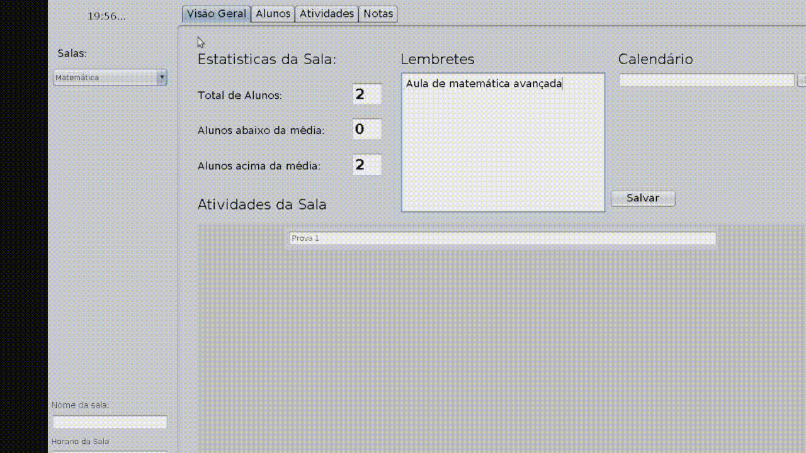
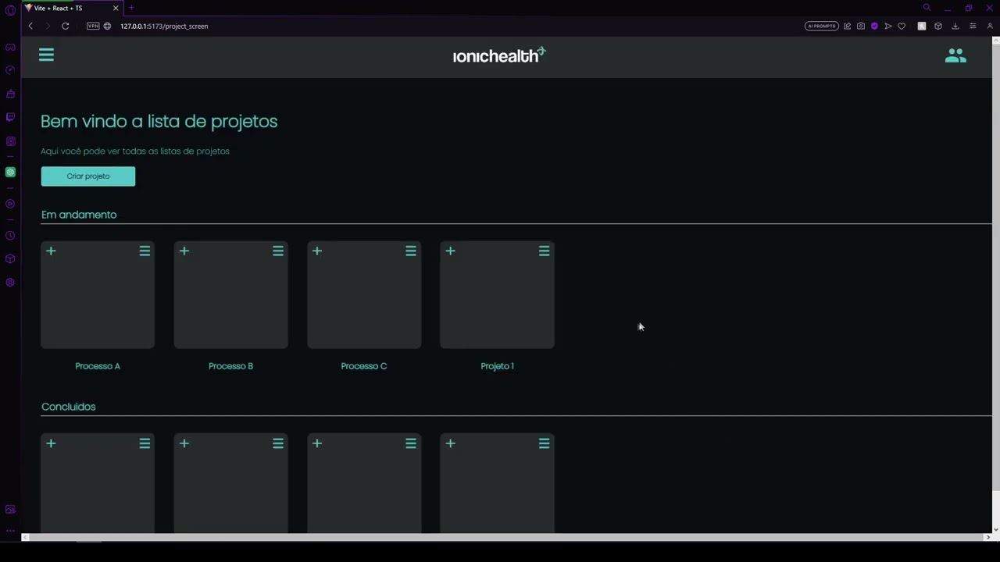
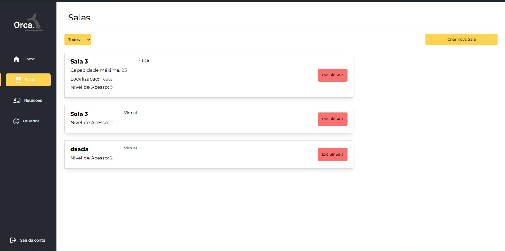
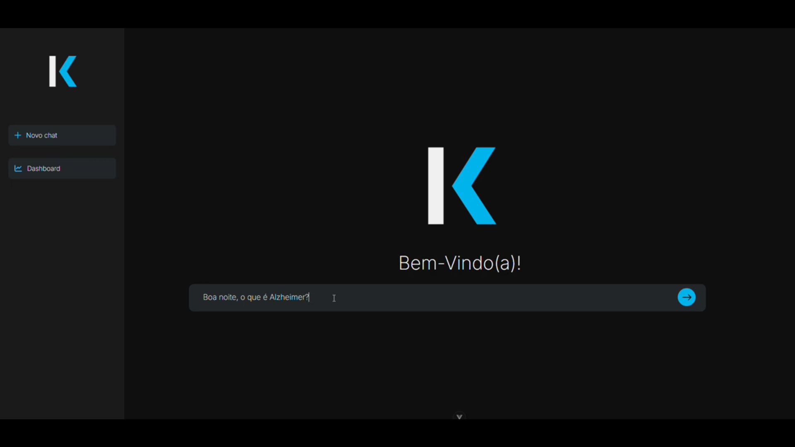

<h1 align="center">Portfólio - Gustavo Henrique Pereira</h1>

## Contatos

- **GitHub**: [gustavohpereira](https://github.com/gustavohpereira)
- **LinkedIn**: [linkedin](https://www.linkedin.com/in/gustavohpa/)
- **email**: [gustavohpa2003@gmail.com](gustavohpa2003@gmail.com)

## Introdução

Sou o Gustavo Henrique, tenho 21 anos e atualmente curso o 5º semestre de Análise e Desenvolvimento de Sistemas na FATEC São José dos Campos (FATEC-SJC). Realizei um curso técnico em assistente administrativo enquanto cursava o ensino médio. Após me formar, me interessei pela área de tecnologia. Minha jornada nessa área começou no início de 2022, quando me dediquei a aprender HTML e CSS por meio de cursos online. Logo depois, iniciei meus estudos na FATEC, onde expandi meu conhecimento em várias linguagens de programação, como Python, Java e TypeScript.

Em 2023, tive a oportunidade de realizar um estágio na área de back-end em uma startup localizada em São Paulo, chamada Giorgio. Essa experiência foi fundamental para solidificar meu conhecimento prático. Além do estágio, também desenvolvi projetos como freelancer e criei iniciativas pessoais de estudo, buscando aprimorar continuamente minhas habilidades no desenvolvimento de software e me preparar para desafios futuros.

## Meus Principais Conhecimentos
#### Front-end
- HTML 
- CSS 
- JavaScript 
- React 
- React Native
- Next
- Tailwind
- Bootstrap

#### Back-end
- Python
- Django
- pandas
- TypeScript 
- NodeJS
- Jest
- NestJS
- Express
- RabbitMQ
  
#### Banco De Dados
- PostgreSQL
- MySQL 
- MongoDB 

#### DevOps
- AWS 
- Git

#### Outros
- Scrum
- Docker
- DatoCMS
- PowerBI

**Conhecimentos que desejo aprimorar**:
- Django, para melhorar minhas habilidades de desenvolvimento web em Python.
- Análise de dados, para aprimorar minhas habilidades com ferramentas de visualização e manipulação de dados.

## Meus Projetos

1º Semestre (2022 - 2)

 

**Data:** *agosto/2022*  
**Empresa:** *FATEC São José dos Campos - SP*  
**Professor responsável:** *JEAN CARLOS LOURENCO COSTA*  
**Problema** Um ambiente academico onde contem inumeros laboratórios precisa de uma forma de saber quais computadores estão com a execução debilitada, saber quais os problemas, e o tecnico precisa informar quais computadores estão em manutenção, quais ja estão restaurados, tudo isso de uma forma visual e fluida
**Desafio:** Realizar a identificação de falhas nos equipamentos dos laboratórios de informática da FATEC-SJC, visando a abertura de solicitações internas para que as devidas correções sejam aplicadas de forma ágil e eficaz.   
**Solução:** Para resolver o problema sugerido, criamos uma solução que facilita a abertura de chamados para o técnico, e também possibilita a visualização rápida do técnico para saber quais máquinas estão em cada sala, e também seu estado, podendo ser personalizado  

**GitHub:** [mirageGroup](https://github.com/MirageGroup/API_MirageGroup)  

### Tecnologias Utilizadas

- **HTML5 & CSS**: Utilizados para criar uma interface web intuitiva e responsiva, que facilita a navegação e uso da aplicação pelos técnicos.
- **JavaScript**: Responsável por tornar a aplicação interativa, oferecendo funcionalidades dinâmicas como o drag and drop para reorganizar os computadores.
- **Flask**: Utilizado no backend para gerenciamento das requisições, integração com o banco de dados e execução das funcionalidades principais da aplicação.
- **MySQL**: Banco de dados utilizado para armazenar todas as informações sobre os chamados técnicos, o estado das máquinas e o histórico de manutenção.
- **AWS**: Plataforma na nuvem que hospeda a aplicação, garantindo sua escalabilidade e segurança.

---

### Contribuições Pessoais

Minhas principais contribuições no projeto foram:

- Implementação do **monitoramento automático das máquinas**, criando uma integração que analisava em tempo real o estado dos equipamentos e notificava os técnicos em caso de falhas e atualizava com base em chamados feitos para o técnico. Utilizei **JavaScript** e **Flask** para essa funcionalidade.
- Desenvolvimento da funcionalidade de **gestão de chamados**, que permitia criar e gerenciar tickets de manutenção técnica. Trabalhei diretamente na interação entre o frontend e o backend, garantindo que os chamados fossem armazenados corretamente no **MySQL**.
- Atuei também na **reorganização virtual das máquinas**, utilizando **JavaScript** para a funcionalidade de drag and drop, o que permitiu que os técnicos pudessem visualizar e reorganizar os computadores nas salas.

---

### Hard Skills

- **HTML5**: Faço/uso com autonomia.
- **CSS**: Faço/uso com autonomia.
- **JavaScript**: Faço/uso com autonomia.
- **Flask**:  Faço/uso com ajuda.
- **MySQL**: Faço/uso com autonomia.
- **AWS**: Faço/uso com ajuda.

---

### Soft Skills

Neste semestre conduzi reuniões com as equipes para discutirmos sobre o projeto, demonstrando comunicação em equipe e também contato com a equipe. Atuei com os membros da equipe para que o projeto continuasse efetivamente, e apliquei a soft skill de  gestão de tempo para que eu pudesse me organizar melhor, utilizando ferramentas de gestão. Por ser nossa primeira API, foi de crucial importância eu me comunicar com todos, e unir a experiencia de cada um, assim conseguimos distribuir com mais eficiência as tarefas, alinhando com a experiencia de cada um no momento

2º Semestre (2023 - 1) 

 

**Data:** *janeiro/2023*  
**Empresa:** *FATEC São José dos Campos - SP*  
**Professor responsavel:** *CLAUDIO ETELVINO DE LIMA*  
**Problema** Uma professora precisa de um sistema que não dependa de internet, e que ela possa gerir completamente a sua sala de uma maneira visual, facil e rapida, assim, necessitando de uma alta disponibilidade e fluidez nos processos
**Desafio:** Desenvolver uma aplicação para organizar aulas, alunos, avaliações, notas e atividades, com foco na operação totalmente offline para garantir flexibilidade em ambientes sem internet.   
**Solução:** Desenvolvemos uma aplicação desktop em Java, que permite a organização completa do ambiente acadêmico, desde a inserção de alunos até a geração de relatórios de avaliações e notas, operando sem conexão à internet.   

**GitHub:** [Projeto](https://github.com/MirageGroup/API_MirageGroup_2sem)  

### Tecnologias Utilizadas

- **Java**: Utilizado tanto no backend quanto no frontend da aplicação.
- **JavaFX**: Ferramenta para construção de interfaces gráficas.
- **SQLite**: Banco de dados local que garante a operação offline da aplicação.

---

### Contribuições Pessoais

Neste projeto atuei como PO e levantei os requisitos e conversei com o cliente, sempre levantando requisitos. Também Desenvolvi a funcionalidade de **gerenciamento de notas e avaliações**, garantindo que as informações fossem salvas corretamente no banco de dados SQLite e criando uma interface amigável em JavaFX para visualização e edição.

---

### Hard Skills

- **Java**: Faço/uso com autonomia.
- **JavaFX**: Faço/uso com ajuda.
- **SQLite**: Faço/uso com autonomia.
---

### Soft Skills

Durante o desenvolvimento dessa API, tivemos o desafio de aprender Java do zero e lidar com uma aplicação desktop, algo completamente novo para a equipe. Mantive o espírito de equipe elevado, organizando um encontro na casa de um dos membros para que pudéssemos programar juntos, o que ajudou a manter todos motivados. Além disso, sempre que surgiam erros no código Java, demonstrei proatividade ao ajudar meus colegas a resolverem-nos, garantindo que o projeto continuasse a progredir sem grandes obstáculos.

3º Semestre (2023 - 2)

 

**Data:** *julho/2023*  
**Empresa:** *Ionic Health*  
**Area de Atuação da empresa:** *Automação e integração de tecnologias destinadas a area medica e de saude*  
**Professor responsável:** *CLAUDIO ETELVINO DE LIMA*  
**Problema** Para fins de documentação e auditoria, gerir processos de uma equipe se torna um processo complexo e dificil, sem lugar para armazenar evidencias documentos sobre o processo, mas tambem sem um ambiente claro e rapido de gerenciar as etapas de projetos intensifica a problematica
**Desafio:** Desenvolver uma plataforma para gerenciamento de equipes e projetos, que permitisse a organização de tarefas e a manutenção de um fluxo eficiente de trabalho com metodologia ágil.   
**Solução:** Criamos uma aplicação em React com uma interface kanban que permite aos usuários organizarem suas tarefas e equipes de forma visual. Incluímos também a funcionalidade de armazenar evidências e o acompanhamento do progresso dos projetos.   

**GitHub:** [linkDoProjeto](https://github.com/MirageGroup/API_MirageGroup_3sem)  

### Tecnologias Utilizadas

- **TypeScript**: Linguagem utilizada tanto no frontend quanto no backend.
- **React**: Framework utilizado para criar uma interface de usuário dinâmica.
- **Node.js**: Backend responsável por gerenciar as requisições e a interação com o banco de dados.
- **TypeORM**: Ferramenta para mapeamento objeto-relacional, facilitando a interação com o banco de dados SQL.

---

### Contribuições Pessoais

Neste projeto atuei como desenvolvedor, Implementei a **funcionalidade kanban**, permitindo que os usuários organizassem suas tarefas visualmente com o drag and drop, e trabalhei na integração com o backend em **Node.js** utilizando **TypeORM** para gerenciamento de banco de dados. Além de criar o sistema de mensagem no Email quando uma reunião for criada ou deletada

---

### Hard Skills

- **TypeScript**: Faço/uso com autonomia.
- **React**: Faço/uso com autonomia.
- **Node.js**: Faço/uso com autonomia.
- **TypeORM**: Faço/uso com autonomia.

---

### Soft Skills

Neste semestre, já tinha estudado React durante as férias, o que me permitiu auxiliar meus colegas no desenvolvimento da aplicação. Assumi um papel de liderança ao ensinar os conceitos de React e orientar o grupo na construção do projeto. Além disso, percebi que seria útil para a equipe adotar um sistema de kanban para organizar as tarefas, então tomei a iniciativa de implementar essa funcionalidade no sistema. Acredito que exercitei a minha proatividade e também o olhar para requisitos, dando uma ação a mais quando necessário

4º Semestre (2024 - 1)

 

**Data:** *fevereiro/2024*  
**Empresa:** *SIATT*  
**Area de Atuação da empresa:** *Fornece soluções de tecnologia para os setores de defesa e aeroespacial*  
**Professor responsavel:** *FABIANO SABHA WALCZAK*  
**Problema** muita dificuldade de administrar muitas salas em um ambiente empresarial, principalmente quando há muitas reuniões de diversos tamanhos, então reservar e cadastrar uma sala para reunião se torna um processo dificil
**Desafio:** Criar uma solução integrada para gerenciar salas de reuniões físicas, híbridas e virtuais, permitindo a criação de atas, controle de permissões e conexão direta ao Zoom.   
**Solução:** Desenvolvemos uma plataforma que facilita o agendamento e a gestão de reuniões, oferecendo a possibilidade de conexão com o Zoom e controle de pautas e permissões dos usuários, tudo de forma integrada em uma interface amigável.   

**GitHub:** [linkDoProjeto](https://github.com/MirageGroup/API_MirageGroup_4sem)  

### Tecnologias Utilizadas

- **React**: Desenvolvimento da interface do usuário.
- **TypeScript**: Linguagem utilizada para o desenvolvimento frontend e backend.
- **Node.js**: Backend responsável por gerenciar as funcionalidades da aplicação.
- **TypeORM**: Integração com o banco de dados para gerenciamento de informações sobre as reuniões.
- **API do Zoom**: Conexão direta com o Zoom para facilitar a organização de reuniões virtuais.
- **AWS**: Hospedagem da aplicação e gerenciamento de serviços na nuvem.

---

### Contribuições Pessoais

Fui responsável por desenvolver a **interface front-end e responsividade**, por meio do react com tailwind, realizei as interfaces home, de reuniões, criação de reuniões,criando uma experiência de usuário otimizada e com compatibilidade com diversos dispositivos.Assim como a dinamica de identificação de cada uma(puxar do banco de dados e filtrar) .
com o uso de UseStates e UseEffects em react consegui fazer a aplicação constantemente checar as reuniões vindas do back-end, assim como horarios, quantidade de pessoas, tipo de reunião

---

### Hard Skills

- **React**: Faço/uso com autonomia.
- **TypeScript**: Faço/uso com autonomia.
- **Node.js**: Faço/uso com autonomia.
- **TypeORM**: Faço/uso com autonomia.
- **API do Zoom**: Faço/uso com ajuda.
- **AWS**: Faço/uso com ajuda.

---

### Soft Skills

Por já estarmos familiarizados com as tecnologias utilizadas  decidi focar na experiência do usuário, e conversar com o grupo quais as melhores decisões para o cliente, assim, exercitei a minha soft skill de comunicação com o grupo, com a primeira sprint marcada por um brainstorm do grupo, assim como cada sprint conter dialogos entre todos para melhorar o produto

5º Semestre (2024 - 2) 

 

**Data:** *julho/2024*  
**Empresa:** *Kersys*  
**Area de Atuação da empresa:** *Gestão florestal e ambiental por meio de soluções de tecnologias*  
**Professor responsavel:** *JEAN CARLOS LOURENCO COSTA*  
**Problema** Pequenos e medios agricultores não tem acesso a uma maneira eficiente de gerir a temperatura e outras metricas de suas zonas de plantio, necessitam de uma forma rapida de registrar e acompanhar
**Desafio:** Desenvolver uma aplicação para monitoramento climatico de plantios e areas agricolas, fornecendo alertas e dados em tempo real   
**Solução:** Desenvolvemos uma aplicação mobile com react native, que permite o usuario registrar, cadastrar, deletar e atualizar areas, e ter acesso aos dados metereologicos e receber alertas de clima  

**GitHub:** [Projeto](https://github.com/MirageGroup/API_MirageGroup_5_Semestre)  

### Tecnologias Utilizadas

- **React native**: Utilizado tanto no Front-end da aplicação
- **TypeScript**: Linguagem utilizada para o desenvolvimento frontend e backend.
- **Node.js**: Backend responsável por gerenciar as funcionalidades da aplicação.
- **TypeORM**: Integração com o banco de dados para gerenciamento de informações sobre as reuniões.
- **Firebase**: Banco de dados NOSQL para armazenar pontos de plantio e dados metereologicos
- **MySQL**: Banco de dados relacional para cadastro de usuarios

---

### Contribuições Pessoais

Neste projeto atuei como Dev e desenvolvi a base do back-end e conexão com o MYSQL, então realizei manutenções nos controllers de usuarios e na conexão com o banco sql. Tambem desenvolvi a tela de registro no front-end e o sistema de mudança na cor e aviso caso um ponto esteja com a temperatura acima ou abaixo do limite  garantindo que o usuario se atente de que os criterios de temperatura estão sendo ultrapassados

### Hard Skills

- **React native**: Faço/uso com autonomia.
- **TypeScript**: Faço/uso com autonomia.
- **Node.js**: Faço/uso com autonomia.
- **TypeORM**: Faço/uso com autonomia.
- **Firebase**: Faço/uso com ajuda.
- **MySQL**: Faço/uso com autonomia.

---

### Soft Skills

Durante o desenvolvimento deste projeto, focamos em aprimorar a organização da equipe, dividindo as responsabilidades de forma equilibrada entre todos os membros. Essa estratégia garantiu que cada pessoa pudesse contribuir de forma significativa e trabalhar dentro de sua especialidade, aumentando a eficiência e a qualidade do projeto. Mantive a comunicação clara e frequente, promovendo alinhamentos regulares para acompanhar o progresso de cada tarefa e garantindo que todos se sentissem apoiados e engajados no processo. Além disso, estimulei a colaboração ao incentivar trocas de ideias e feedbacks construtivos entre os integrantes, o que fortaleceu o trabalho em equipe e a entrega dos resultados.

6º Semestre (2025 - 1) 

 

**Data:** *Fevereiro/2025*  
**Empresa:** *DOMROCK*  
**Area de Atuação da empresa:** *Gestão de dados e inteligencia artificial*  
**Professor responsavel:** *Eduardo Sakaue*  
**Problema** Cuidadores de pessoas com Alzheimer frequentemente enfrentam desafios na tomada de decisões e na obtenção de informações confiáveis e específicas sobre o cuidado diário, principalmente em situações emergenciais ou pouco abordadas nos materiais convencionais.
**Desafio:** Desenvolver uma solução tecnológica baseada em inteligência artificial que ofereça suporte informativo e personalizado a cuidadores, com embasamento científico confiável.   
**Solução:** Desenvolvemos uma aplicação que utiliza uma LLM (Large Language Model) combinada com a técnica de RAG (Retrieval-Augmented Generation), treinada com uma base de documentos científicos relacionados ao Alzheimer. A ferramenta permite ao cuidador consultar a IA sobre dúvidas relacionadas aos cuidados, recebendo respostas fundamentadas.
Além disso, o sistema conta com um módulo de Human Feedback, onde o usuário pode visualizar respostas geradas por dois modelos diferentes e avaliá-las com base em critérios  permitindo o aprimoramento contínuo do sistema.  

**GitHub:** [Projeto](https://github.com/MirageGroup/API_MirageGroup_6_Semestre)  

### Tecnologias Utilizadas

- **vue3**: Utilizado tanto no Front-end da aplicação
- **tailwind**: Estilização do front-end
- **TypeScript**: Linguagem utilizada para o desenvolvimento frontend.
- **SpringBoot**: Backend responsável por gerenciar as funcionalidades de review da aplicação.
- **Python**: Utilizado para fazer o back-end e o llm
- **Groq**: ultilizado para acelerar o processo de llm
- **Langchain**: Ultilizado para manusear os modelos de llm
- **Fastapi**: Utilizado para fazer a API rest de nossa llm python
- **MongoDB**: Banco de dados NoSQL utilizado para armazenar feedbacks dos modelos.
- **Chroma**: Banco vetorial utilizado para armazenar e recuperar documentos de forma semântica com base em embeddings, essencial para o funcionamento do RAG.

---

### Contribuições Pessoais

Fui responsável por fazer manutenções na arquitetura da llm e seu prompt, além de configurar a comunicação entre o FastAPI e o front-end via Spring Boot. Trabalhei tambem em auxilios no front-end como digitação da resposta em tempo real e bugs de requisição para o spring-boot.Alem de fazer manutenções na comunicação front-springBoot-fastAPI

### Hard Skills

- **vue3**: Faço/uso com autonomia
- **tailwind**: Faço/uso com autonomia
- **TypeScript**: Faço/uso com autonomia
- **SpringBoot**: Faço/uso com autonomia.
- **Python**: Faço/uso com autonomia
- **Fastapi**: Faço/uso com ajuda
- **MongoDB**: Faço/uso com autonomia.
- **Chroma**: Faço/uso com ajuda.
- **Groq**:  Faço/uso com autonomia
- **Langchain**: Faço/uso com autonomia

---

### Soft Skills

Este projeto me desafiou a aplicar IA de forma que exercitei a comunicação entre áreas técnicas distintas (Java, Python, Front-end), além da organização do trabalho em equipe com foco em testar e fazer o melhor prompt para o llm. O ciclo de testes e validações também fortaleceu minha visão de produto e capacidade de adaptação com base em feedbacks.

